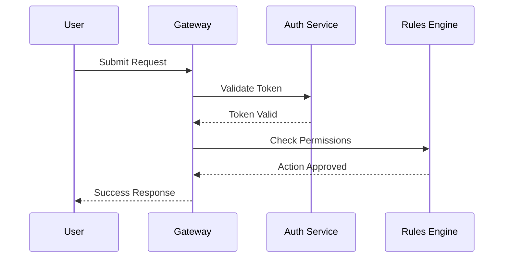

## Overview

**HSAG Ingeniousity** is a highly scalable, multi-tenant framework designed to handle complex rules, user moderation, and data syncing across multiple platforms. Originally conceptualized for the Doubts Group A, it has since evolved into a standalone engine.

> [!NOTE]
> The legacy documentation is hosted externally on Craft. This page serves as the updated technical hub for developers integrating the Ingeniousity Framework.

---

## 🏗️ System Architecture

The Ingeniousity Framework is built on a microservices architecture, prioritizing speed, redundancy, and strict moderation rules.



---

## ⚡ Core Modules

### 1. The Moderation Engine
The Moderation Engine automatically scans user inputs against a predefined set of rules. 

- **Swear Filter:** O(1) lookup time using a highly optimized Hash Trie.
- **Spam Prevention:** Rate limits users using a Token Bucket algorithm.
- **Auto-Ban Protocol:** If a user reaches a threshold of 3 warnings, the protocol automatically restricts write-access.

### 2. Live Sync API
The framework provides real-time data syncing across clients using WebSockets.

#### Connecting to the WebSocket
```javascript
import { IngeniousityClient } from '@hsag/ingeniousity';

const client = new IngeniousityClient({
  url: 'wss://api.hsag.dev/v1/stream',
  apiKey: 'YOUR_API_KEY'
});

client.on('message', (data) => {
  console.log('Received real-time update:', data);
});
```

---

## 📜 Rules and Regulations

The HSAG ecosystem operates under strict guidelines to maintain a healthy environment. 

> [!IMPORTANT]
> Violation of the Terms of Service may result in a permanent ban across all connected applications.

1. **Zero Tolerance Policy:** Hate speech, discrimination, and bullying are strictly prohibited.
2. **Data Privacy:** We do not track or sell user data. All telemetry is anonymized.
3. **Accountability:** Group administrators are fully liable for the actions of their members if they fail to enforce the Moderation Engine.

### External References
- [HSAG Terms of use and service](https://www.craft.me/s/WhCjCReHCTSJfQ)
- [HSAG Privacy Policy](https://www.craft.me/s/UCuglUHhH4pOVW)
