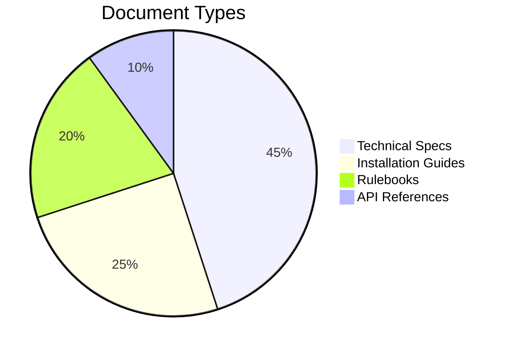

# Welcome to the Docs 📖

Welcome to the central repository for all my project documentation, rulebooks, and technical guides. Whether you're looking to install **Spring Lock** or integrate the **HSAG Framework**, you're in the right place.

## How to use these docs

The documentation is organized linearly, but you can jump to any section using the **left sidebar navigation**. 

- **Spring Lock**: Everything you need to secure your iOS devices.
- **HSAG Ingeniousity**: The technical architecture and rules behind the HSAG ecosystem.

## Documentation Standards

We hold our documentation to the highest standard. Throughout these guides, you will find:

### 1. Highlighted Alerts
Pay attention to these boxes, as they contain critical information.

> [!NOTE]
> This is a note containing background context.

> [!WARNING]
> This is a warning about potential breaking changes.

> [!CAUTION]
> This is a severe caution regarding data loss or security.

### 2. Code Snippets
We provide copy-paste ready code snippets for quick integration:

```python
def hello_world():
    print("Welcome to the beautiful documentation!")
```

### 3. Architecture Diagrams
Complex systems are broken down into easy-to-understand visual diagrams:



## Beautiful Cards in MDX
You can drop React components right into your markdown! 

<CardGrid>
  <Card title="Spring Lock" href="/docs/spring-lock">
    Secure your iOS devices using state-of-the-art encryption algorithms.
  </Card>
  <Card title="HSAG Framework" href="/docs/hsag-ingeniousity">
    Scalable microservices for real-time web sync and moderation.
  </Card>
</CardGrid>

Start exploring by clicking on a topic in the sidebar!
