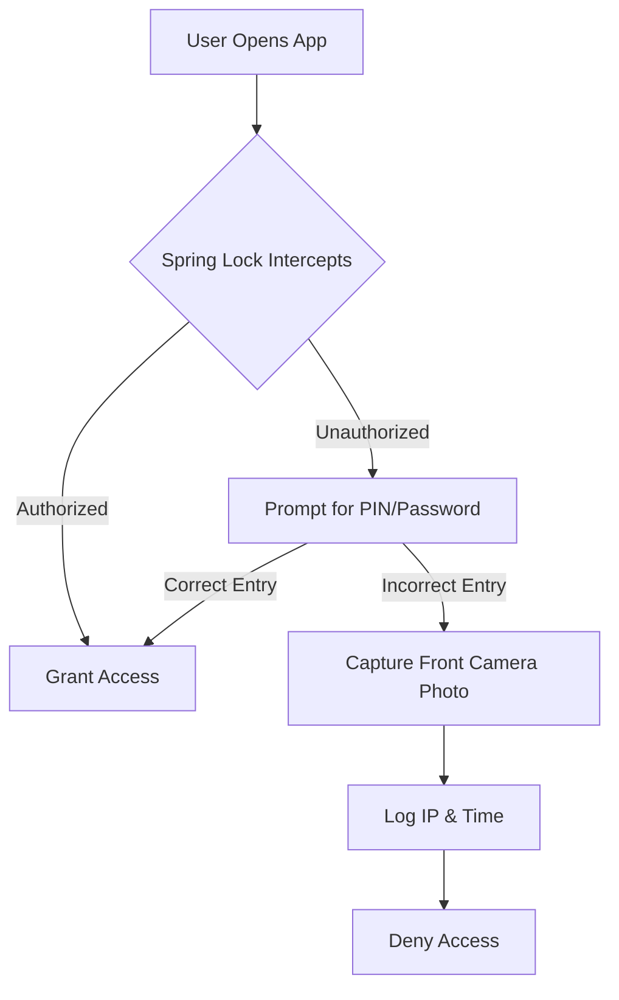

**Spring Lock** is the evolved successor to **HSAG AppLock**, offering a robust, secure, and user-friendly experience to lock apps and protect sensitive data across the Apple ecosystem. With its integration of state-of-the-art encryption tools and system automations, this tool guarantees unmatched security and flexibility for power users and administrators alike.

---

## 🚀 Quick Start & Installation

To get started with Spring Lock, ensure you are running iOS 15+, iPadOS 15+, or macOS Monterey+.

1. Download the shortcut from the official repository.
2. Add the shortcut to your Shortcuts app.
3. Upon first run, the **Setup Wizard** will initialize.

> [!CAUTION]
> If you skip the initial setup wizard, Spring Lock will automatically lock itself down to prevent unauthorized backdoor access. You must complete the setup process entirely.

### Permissions Required
The following permissions are requested during installation and must be granted for optimal functionality:

| Permission | Purpose |
|------------|---------|
| **Shortcuts Data Folder** | To securely store your encrypted configuration data. |
| **Google Drive (WebKit)** | To fetch the latest guidance videos and cloud updates. |
| **Front Camera** | To silently capture photos of unauthorized users attempting to guess your PIN. |

---

## 🔐 Core Architecture

Spring Lock employs a hybrid encryption mechanism utilizing **CryptoKit** and a customized **CryptoEngine**.



### Advanced Tamper Detection
We use MD5 hashing to ensure configuration files are not tampered with. If a discrepancy is found, Spring Lock will revert to the last known secure state.

```javascript
// Example of the validation logic used internally
function validateIntegrity(configHash) {
  const currentHash = generateMD5(config);
  if (currentHash !== configHash) {
      triggerLockdown();
      restoreBackup();
  }
}
```

---

## 🛡️ Security Features

### 1. Two-Factor Authentication (2FA)
Unlike standard app locks, Spring Lock requires both a numeric PIN and an alphanumeric password for administrative access. This two-step verification adds an exponential layer of security.

### 2. Intruder Alerts
If a user fails the login attempt three times, the front camera is triggered silently. The image is saved directly to a hidden directory in the Shortcuts Data folder, completely bypassing the Photos app to prevent the intruder from deleting it.

### 3. Ghost Accounts
You can pre-configure "Ghost Accounts" with fake passwords. If an intruder forces you to unlock an app, providing the Ghost Password will unlock a restricted, sandboxed version of the app.

---

## 🛠️ Advanced Settings & Customization

> [!TIP]
> You can access the Admin Panel by typing `admin:dashboard` in the password field.

Within the settings menu, you have access to:
- **UI Customization**: Switch between Dark Mode, Light Mode, and OLED Pitch Black.
- **Auto-Lock Timers**: Set custom grace periods (e.g., app remains unlocked for 5 minutes after leaving).
- **Silent Mode Overrides**: Force the device to ring an alarm if an intruder fails login, even if the phone is on silent.

## 📦 Version History & Migration

### **Version 5.3 (Current)**
- **Status**: Stable
- **Updates**:
  - Updated Icon Pack.
  - Mitigated the multiple decimal points error in the updater engine.
  - Restored missing setup screens from 5.2.

> [!WARNING]
> If you are migrating from HSAG AppLock (Version 4 or below), do **not** delete your old configuration files until the Version 5 migration tool explicitly instructs you to do so, otherwise you will permanently lose your encrypted vaults.
